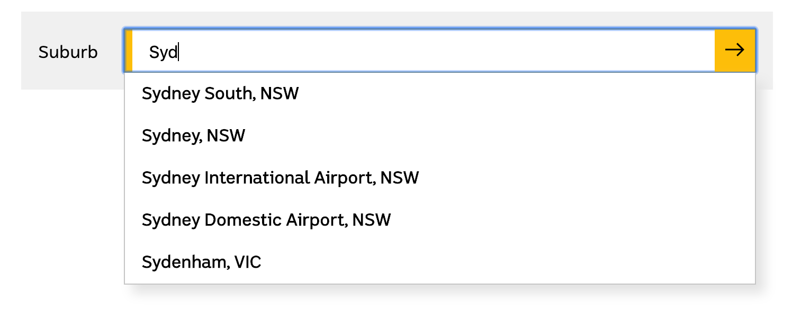

# Frontend Coding Exercise

## Summary

Implement an auto-complete field that uses suburb information from postcodeapi.com.au to suggest suburb names and allow the user to make a suggestion. This design is similar to the input seen on https://google.com or the [ABC homepage](www.abc.net.au) location selector component.

## Scope

This exercise is intended to explore you understanding of HTML, CSS and JavaScript. The provided React structure is provided as a starting point, you are encouraged to change or remove it as you see fit.

You do not have to complete all the requirements, but we encourage you to make an attempt at addressing all three areas, rather than submitting a fully fleshed-out solution to just one. You may use ARCHITECTURE.md to detail any solutions that would take too long to implement in code.

## Requirements

1\. Layout and CSS:

- Use the provided `<Input />`, `<Button />` and `<ResultsList />` as well as your own markup and CSS to render a layout similar to the image below.
- The label, input and button should be horizontally aligned.
- The results should be displayed immediately below the input.

2\. Interactivity:

- When typing a suburb name into the input the result list show suggestions provided by the API.
- Show only results that _start_ with the search term. The input "Syd" should match "Sydenham and "Sydney South", but not "The University Of Sydney" or "Aldersyde".
- Clicking a suggestion should populate the input with the full name of the suburb.
- Clicking the button should show an alert informing the user of their most recent suburb selection.

3\. Accessibility:

- Implement, or document in ARCHITECTURE.md, some enhancements that would improve accessibility.



## Getting Started

**DO NOT** fork this repo. Please locally clone and submit the result manually.

```
git clone https://github.com/abcaustralia/frontend-coding-exercise.git
cd frontend-coding-exercise
npm install
npm start
```

This project uses data provided by postcodeapi.com.au. Due to CORS limitations `npm start` will start a local proxy server on http://localhost:8010/proxy.
